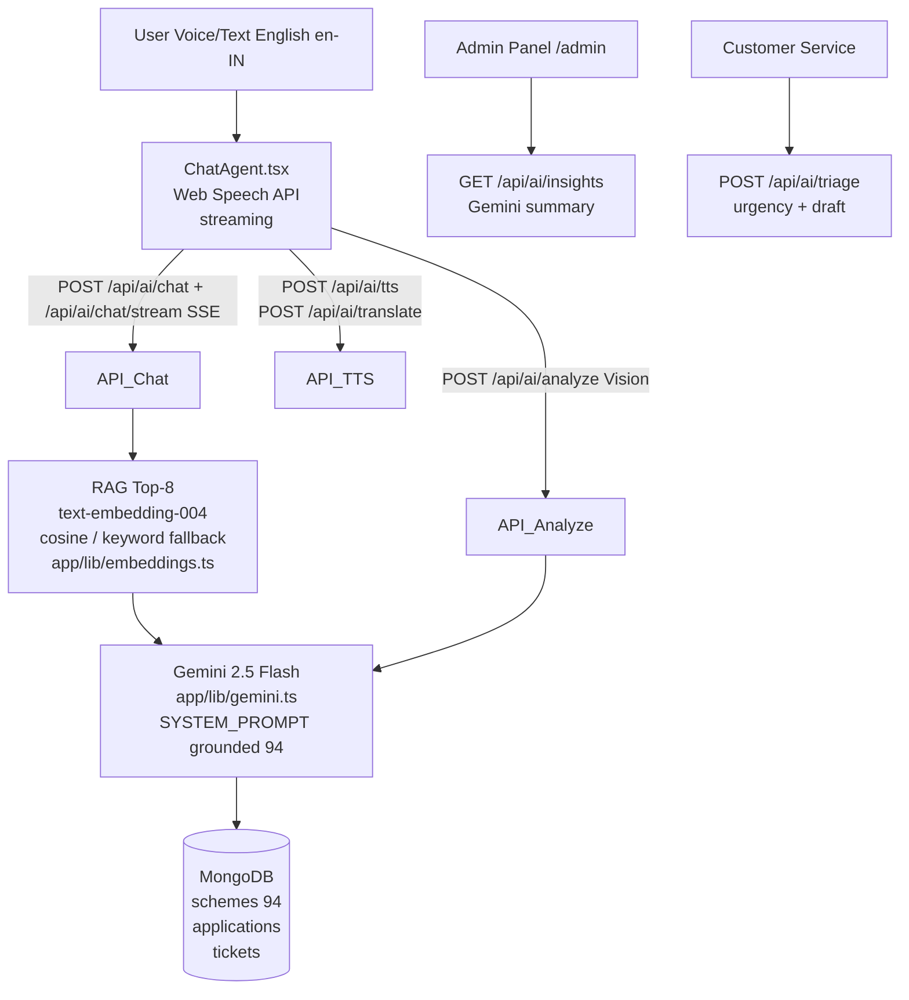

# scheme.gov — Architecture (for Judges)

## Gemini Usage (200 words for Devpost)

**Model:** `gemini-2.5-flash` (env `GEMINI_MODEL`, fallback `gemini-2.0-flash`) via `@google/generative-ai` + `@google/genai` (`text-embedding-004` for RAG). **Why central:** Every user query is grounded RAG — `retrieveTopSchemes()` embeds query, cosine-ranks 94 schemes, injects top 8 as context into `SYSTEM_PROMPT` ("only cite provided schemeId", English-only). This makes answers factual, citable, income/state aware. **Streaming:** `/api/ai/chat/stream` uses `generateContentStream` → SSE typewriter, judges see live reasoning. **Vision:** `/api/ai/analyze` sends `inlineData` to Gemini to OCR Aadhaar/land docs → validates completeness/eligibility. **Insights:** `/api/ai/insights` aggregates Mongo and asks Gemini for 4-bullet English admin summary. **Triage:** `/api/ai/triage` classifies urgency/sentiment and drafts English reply. **Voice:** Permissions-Policy `microphone=(self)` + Web Speech (en-IN) + server TTS normalization via Gemini. **Translate:** `/api/ai/translate` keeps scheme names in English. Demo fallback rule-based when `GEMINI_API_KEY` missing so submission still runnable.

## Endpoints

| Method | Endpoint | Gemini Feature |
|---|---|---|
| POST | /api/ai/chat | Grounded chat, RAG top-8 |
| POST | /api/ai/chat/stream | Streaming SSE |
| POST | /api/ai/analyze | Vision OCR + eligibility |
| POST | /api/ai/triage | Classify + draft reply |
| POST | /api/ai/translate | Translate (scheme names stay English) |
| POST | /api/ai/tts | TTS normalization |
| GET | /api/ai/insights | Admin summary |

Env: `GEMINI_API_KEY` from aistudio.google.com/app/apikey
